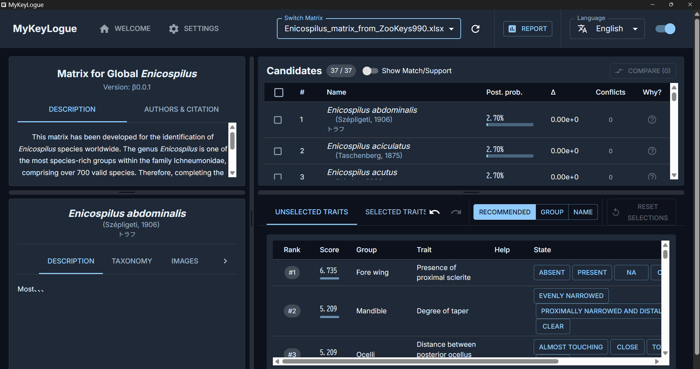

# MyKeyLogue

<p align="center">
  <a href="LICENSE"></a>
  
  
  
  
  
</p>

<!-- 任意: アプリアイコン -->
<!-- <p align="center"></p> -->

<p align="center">
  
</p>

## README Language / 表示言語

[English](#english) • [日本語](#日本語)

## english

---

## Overview

## MyKeyLogue generates and runs **multi-access keys** directly from an **Excel-based trait matrix**, enabling you to input observable characters in any order and dynamically filter candidates. Bayesian-style scoring helps under uncertainty by highlighting the most plausible taxa.

## Key Features

- **Cross-platform**  
  Runs on Windows / macOS / Linux.
- **Matrix-first workflow**  
  Author and edit keys in familiar Excel; the app reads matrices directly.
- **Statistical identification engine**  
  Recomputes candidate probabilities after each trait selection; adjustable tolerance for missing or ambiguous data.
- **Interactive UI**  
  Candidate list, trait list with help text & images, detail panes, selection history, “Why?” explanations, and **Compare** view.
- **Multilingual UI**  
  English and Japanese supported.

---

## Quick Start

1. **Prepare your dataset**  
   On first launch, the app creates sibling folders:  
    `keys/` (matrices), `help_materials/` (help images), `my_identification_reports/` (reports). Use sample Excel files in `keys/` as templates.
2. **Identify**  
   Select observable traits (any order). The candidate list updates live with a **recommendation score** that reflects statistical utility, difficulty, and risk.
3. **Interpret results**  
   Click a candidate taxon for details; use **Why?** to see matches/conflicts; **Compare** multiple taxa to highlight diagnostic differences.  
    **Note:** Scores are **relative to the loaded matrix**; the true specimen might be outside the key.

---

## Data Format (Excel)

Use Excel `.xlsx` with **three sheets**:

| Sheet Name   | Role (EN)                                                           |
| ------------ | ------------------------------------------------------------------- |
| `MatrixInfo` | Metadata for the entire key (title, authors, citation, etc.)        |
| `TaxaInfo`   | List of taxa and details (scientific/vernacular names, description) |
| `Traits`     | Characters used for identification and their states per taxon       |

### `Traits` Sheet Headers

| Header                        | Required |                                                                                                                                      |
| ----------------------------- | -------- | ------------------------------------------------------------------------------------------------------------------------------------ |
| `#TraitID`                    | Optional | Unique ID (auto-generated from `#Trait_en` if omitted); used for dependencies.                                                       |
| `#Dependency`                 | Optional | `parent_trait_id=state_name`; only show when the parent has the specified state.                                                     |
| `#Group_en / #Group_ja`       | Required | Grouping label (e.g., Head, Wings).                                                                                                  |
| `#Trait_en / #Trait_ja`       | Required | Character name shown in the UI.                                                                                                      |
| `#Type`                       | Required | Character type (see below).                                                                                                          |
| `#HelpText_en / #HelpText_ja` | Optional | Definition and how-to-observe; displayed in help panel.                                                                              |
| `#HelpImages`                 | Optional | Comma-separated image filenames in `help_materials/`. 。                                                                             |
| `#Difficulty`                 | Optional | Observation difficulty; affects recommendation. Accepted: `Easy`, `Normal`, `Hard`, `Very Hard`, or a positive number.               |
| `#Risk`                       | Optional | Misinterpretation risk; affects recommendation. Accepted: `Lowest`, `Low`, `Medium`, `High`, `Highest`, or a number between 0 and 1. |

#### Character Types

- `binary`: presence/absence (e.g., `1`, `y`, `present` = Yes; `-1`, `n`, `absent` = No)
- `nominal_parent`: multiple **exclusive** states (e.g., body color)
- `continuous`: numeric values
- `categorical_multi`: multiple **simultaneous** states (e.g., distribution)

**Best Practices**  
Prefer objective traits (e.g., “Punctate: yes/no”) and move nuance into help text, instead of vague scales like “weakly punctate.”

---

## Installation

**Prereqs**

- Go **1.18+**
- Node.js **16+**
- Wails CLI

```bash
# Install Wails
go install github.com/wailsapp/wails/v2/cmd/wails@latest

# Clone and enter
git clone https://github.com/soshimizu/identification-key.git
cd identification-key

# Install frontend deps
cd frontend && npm install && cd ..

# Build the app
wails build
```

Artifacts will be in `build/bin/`.

---

## Usage

1. **Launch**: run the executable in `build/bin/`.
2. **Load matrix**: choose a matrix from the top dropdown.
3. **Select traits**: pick any observable traits; candidates update live.
4. **Inspect**: click a candidate for details; use **Why?** to view supporting/conflicting traits; **Compare** for side-by-side differences.
5. **Reports**: outputs are saved under `my_identification_reports/`.

---

## Contributing

Issues and PRs are welcome. Please discuss large changes in an issue first.

- GitHub: [https://github.com/soshimizu/identification-key](https://github.com/soshimizu/identification-key)
- Issues: [https://github.com/soshimizu/identification-key/issues](https://github.com/soshimizu/identification-key/issues)

---

## Citation

**EN (software):**
Shimizu S. (2025) _MyKeyLogue: A Software Platform for Interactive Multi-Access Keys in Taxonomic Identification._ [https://github.com/soshimizu/identification-key](https://github.com/soshimizu/identification-key)

**Matrices:**
When publishing results built with a given matrix, cite the matrix as specified by its author **in addition** to citing this software.

---

## License

## **EN:** Released under the **MIT License**. See [`LICENSE`](LICENSE).

## Author

So Shimizu, PhD

- Email: [parasitoidwasp.sou@gmail.com](mailto:parasitoidwasp.sou@gmail.com)
- Affiriation: NARO
- Personal homepage: [https://soshimizu.com/](https://soshimizu.com/)
- Database: [https://ichneumonoidea-world.com/](https://ichneumonoidea-world.com/)

## 日本語

---

## 概要

## **Excel の形質マトリクス**から**マルチアクセスキー**を自動生成・実行します。観察可能な形質を**順不同**で入力して候補を動的に絞り込み、**ベイズ的な確率評価**により不確実性下でも最も有力な候補を提示します。

## 主要機能

- **クロスプラットフォーム**  
  Windows / macOS / Linux で動作。
- **Matrix-first workflow**  
  なじみのある **Excel** で検索表を作成・編集し、そのまま読み込み。
- **統計的アルゴリズムに基づく検索表エンジン**  
  形質選択ごとに候補の**確率**を再計算。欠損や曖昧さへの許容度を調整可能。
- **対話型 UI**  
  候補リスト、形質一覧（ヘルプ/画像）、詳細パネル、選択履歴、**Why?** の根拠表示、**比較**機能。
- **多言語対応 UI**  
  **英語 / 日本語**に対応。

---

## クイックスタート

1. \*\*データセットの用意  
   初回起動時に `keys/`（マトリクス）, `help_materials/`（補助画像）, `my_identification_reports/`（レポート）を自動生成。`keys/` 内のサンプル Excel を雛形に編集。
2. **検索手順**  
   観察できる形質を**順不同**で選択。統計的有効度・**難易度**・**リスク**を考慮した推奨スコアで効率的に絞り込み。
3. **結果の解釈**  
   候補名から詳細へ。**Why?** で一致/矛盾の根拠を確認し、**比較**で識別点を把握。  
    **注意:** Scores are **relative to the loaded matrix**; the true specimen might be outside the key.

---

## データ形式（Excel）

Excel（`.xlsx`）で**3 つのシート**に分割して管理します。

| Sheet Name   | 役割（JP）                                                 |
| ------------ | ---------------------------------------------------------- |
| `MatrixInfo` | マトリクス全体のメタデータ（タイトル、作者、引用情報など） |
| `TaxaInfo`   | 分類群（Taxon）の一覧と詳細情報（学名・和名・解説など）    |
| `Traits`     | 同定に使用する形質と、各分類群の形質状態                   |

### `Traits` シートの主なヘッダー

| Header                        | Required |                                                                                     |
| ----------------------------- | -------- | ----------------------------------------------------------------------------------- |
| `#TraitID`                    | Optional | 形質の一意 ID。省略時は `#Trait_en` から自動生成。依存関係で参照。                  |
| `#Dependency`                 | Optional | `親TraitID=状態名` 形式。条件成立時のみ UI に表示。                                 |
| `#Group_en / #Group_ja`       | Required | 形質グループ名（例：頭部、翅）。                                                    |
| `#Trait_en / #Trait_ja`       | Required | UI に表示される形質名。                                                             |
| `#Type`                       | Required | 形質の型（後述）。                                                                  |
| `#HelpText_en / #HelpText_ja` | Optional | 定義・観察方法などの補助説明（ヘルプに表示）。                                      |
| `#HelpImages`                 | Optional | `help_materials/` に置く画像ファイル名（カンマ区切り）。                            |
| `#Difficulty`                 | Optional | 観察難易度。推奨度に影響。`Easy` / `Normal` / `Hard` / `Very Hard` または正の数値。 |
| `#Risk`                       | Optional | 誤判定リスク。推奨度に影響。`Lowest`〜`Highest` または 0〜1 の数値。                |

#### 形質タイプの指針

- `binary`: **有無/はい・いいえ**（`1`,`y`,`present` = Yes / `-1`,`n`,`absent` = No）
- `nominal_parent`: 相互排他的な**複数状態**（例：体色）
- `continuous`: **数値**
- `categorical_multi`: **複数状態が同時**に成り立つ（例：分布域）

**コツ**  
 「弱く点刻」などの主観的表現は避け、「点刻の有無」のように客観化し、細部はヘルプで補足。

---

## インストール

**前提条件**

- Go **1.18+**
- Node.js **16+**
- Wails CLI

```bash
# Install Wails
go install github.com/wailsapp/wails/v2/cmd/wails@latest

# Clone and enter
git clone https://github.com/soshimizu/identification-key.git
cd identification-key

# Install frontend deps
cd frontend && npm install && cd ..

# Build the app
wails build
```

生成物は `build/bin/` に出力されます。

---

## 使い方

1. **起動**: run the executable in `build/bin/`.
2. **マトリクス選択**: choose a matrix from the top dropdown.
3. **形質選択**: pick any observable traits; candidates update live.
4. **詳細**: click a candidate for details; use **Why?** to view supporting/conflicting traits; **Compare** for side-by-side differences.
5. **レポート**: outputs are saved under `my_identification_reports/`.

---

## 開発・貢献

不具合報告・機能要望・PR 歓迎。大きな変更は事前に Issue で議論してください。

- GitHub: [https://github.com/soshimizu/identification-key](https://github.com/soshimizu/identification-key)
- Issues: [https://github.com/soshimizu/identification-key/issues](https://github.com/soshimizu/identification-key/issues)

---

## 引用

**ソフトウェア引用:**
Shimizu S. (2025) _MyKeyLogue: A Software Platform for Interactive Multi-Access Keys in Taxonomic Identification._ [https://github.com/soshimizu/identification-key](https://github.com/soshimizu/identification-key)

**マトリクスの引用:**
本ソフトで作成・利用したマトリクスを研究等で用いる場合は、**ソフトの引用に加え**、各マトリクス作者が指定する引用情報にも従ってください。

---

## ライセンス

本プロジェクトは **MIT ライセンス** です。詳細は [`LICENSE`](LICENSE) を参照。

---

## 著者

清水　壮, 博士（農学）

- Email: [parasitoidwasp.sou@gmail.com](mailto:parasitoidwasp.sou@gmail.com)
- Affiriation: 農研機構
- Personal homepage: [https://soshimizu.com/](https://soshimizu.com/)
- Database: [https://ichneumonoidea-world.com/](https://ichneumonoidea-world.com/)
